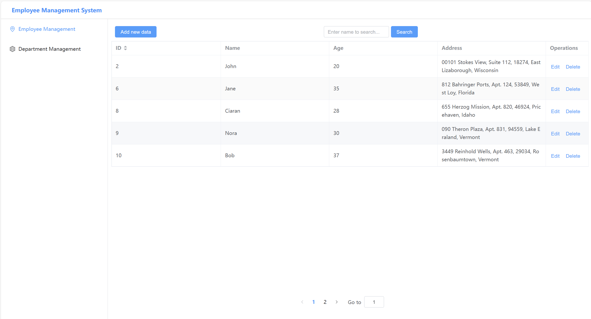
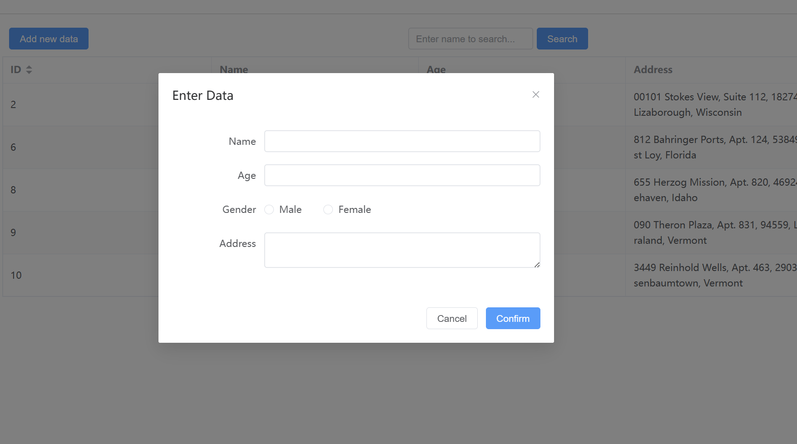
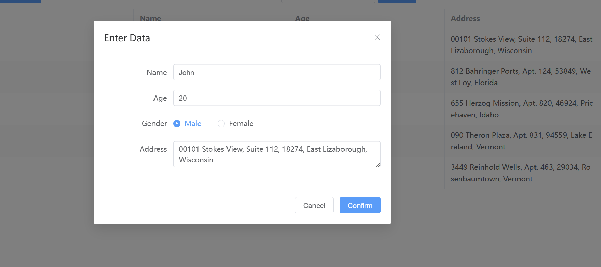
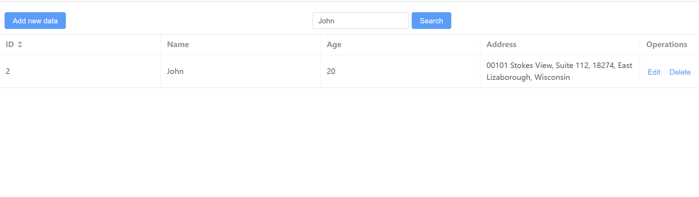

# spring-vue-demo
## Overview
This is a employee management system base on **Java SpringBoot framework**, **MyBatis** and **Vue.js**,
- Allows user to view and manage data of employees and departments (Add, Edit, Delete)

>---
> ## Tools used
> - Front-end
>    - Vue.js
>    - Axios
>    - element-ui
> - Back-end
>   - Java
>   - Springboot Framework
>   - MyBatis Framework
>   - MYSQL
> ---
---
## User Interface

- Built base on **element-ui** component library
- Table to display data
- Navigator bar aside
- Functional buttons
---
### Add function

- Allows user to input set of data for new employee
- Send data to back-end through **http request** via **Axios**
---
### Edit function

- Display the current data of employee
- When confirm is clicked, pass new data to back-end
---
### Search function

- Search for specific employee by name

